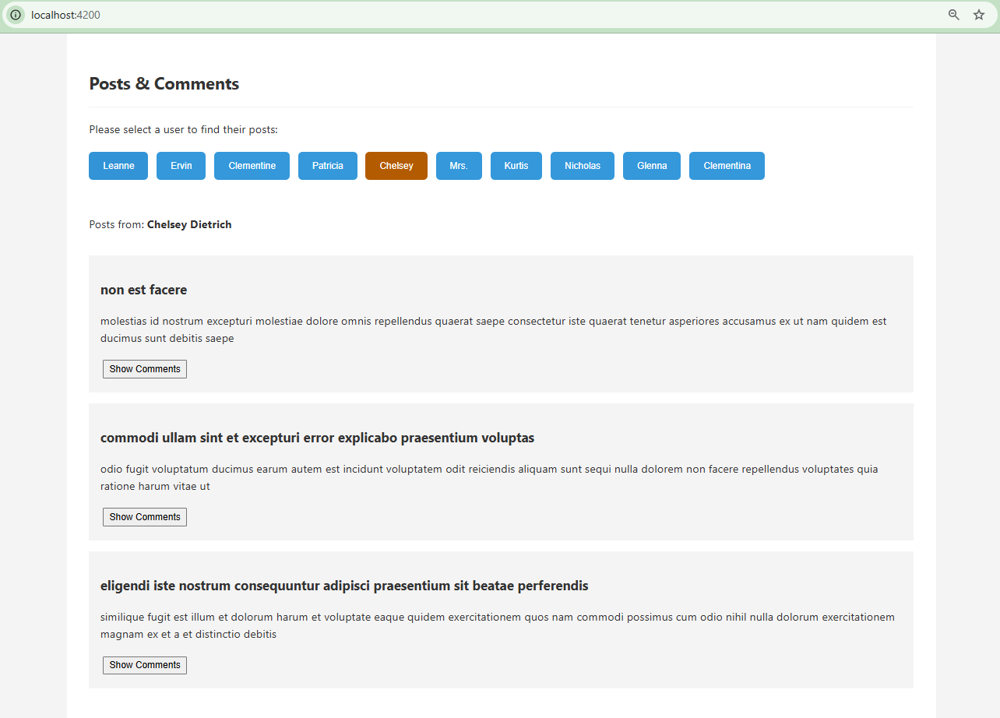

# Posts & Comments App (Angular 17)

This is a simple single-page application (SPA) built with Angular 17 
 - fetches users, posts, and comments from [JSONPlaceholder](https://jsonplaceholder.typicode.com/). 
 - component-based architecture, 
 - API integration, routing, SCSS styling, and unit testing.

---

## 🔧 Environment Details
- **Angular CLI:** 17.3.17
- **Node:** 20.9.0
- **Package Manager:** npm 10.8.2
- **OS:** Windows x64
- **Server Side Rendering:** ❌ Not used

---

## 🚀 Setup Instructions

### 1. Generate Project
```bash
ng new posts-comments-app --routing=true --style=scss
```

### 2. Generate Components & Services
```bash
ng generate component components/user-list
ng generate component components/post-list
ng generate component components/comment-list
ng generate component pages/home
ng generate service services/api
ng generate component components/loading-spinner
```

### 4. Serve the App
```bash
cd posts-comments-app
npm install
ng serve
```

---

## 🧱 Project Structure
```
src/
├── app/
│   ├── components/
│   │   ├── user-list
│   │   ├── post-list
│   │   └── comment-list 
│   ├── pages/home
│   ├── services/api.service.ts
│   └── app.module.ts
├── styles/_variables.scss
├── assets/
└── index.html
```

---

## 🧪 Unit Testing
```bash
ng test --code-coverage
```
View coverage report:
```bash
start coverage/index.html
```
---

## 📸 Screenshots


---
